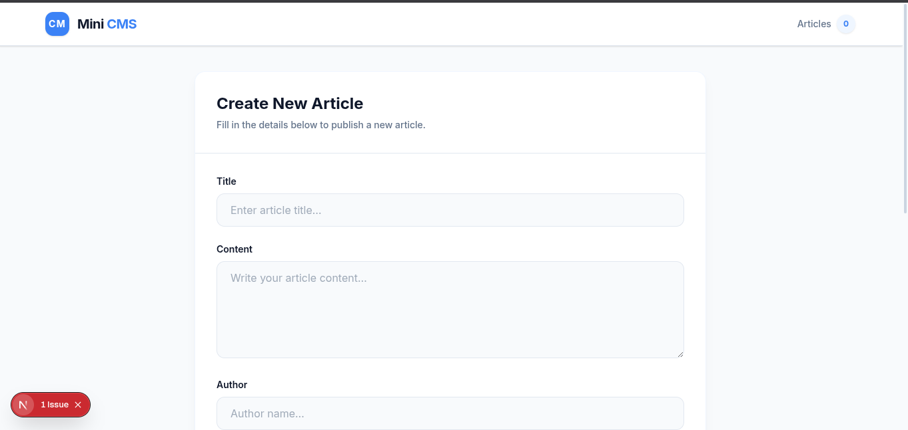
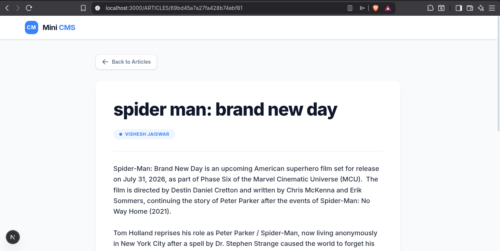
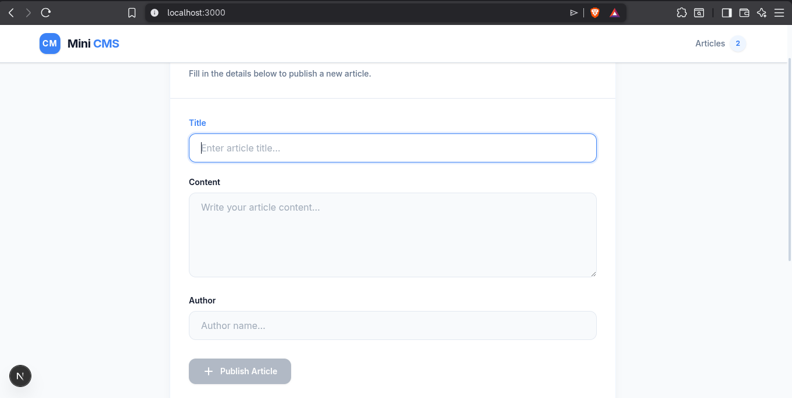

# Project Report: Mini CMS (Content Management System)

**Author:** Vishesh Jaiswar  
**Date:** March 2026  
**Course/Subject:** Full Stack Web Development

---

## 1. Abstract

The Mini Content Management System (CMS) is a modern, full-stack web application designed to simplify the creation, management, and display of digital content. Built using Next.js for the frontend and Node.js with Express for the backend, this project demonstrates the seamless integration of a responsive user interface with a robust, scalable backend architecture connected to a MongoDB database. The primary purpose of this project is to provide a comprehensive, hands-on understanding of full-stack development by implementing core CRUD (Create, Read, Update, Delete) functionalities in a real-world scenario.

---

## 2. Introduction

A Content Management System (CMS) is a software application that enables users to create, edit, collaborate on, publish, and store digital content. CMS platforms are widely used for enterprise content management and web content management. 

This project is highly useful because it abstracts away the complexities of interacting directly with a database or writing raw server code every time content needs to be updated. By developing this Mini CMS, users have an intuitive interface to manage articles dynamically, giving them full control without needing technical expertise after the initial setup.

---

## 3. Objective

The main objectives of developing this project were:
- **Learn Full Stack Development:** Gain practical experience by combining frontend and backend technologies.
- **Understand API Communication:** Learn how the client interacts with the server through RESTful APIs.
- **Implement CRUD Operations:** Successfully achieve Create, Read, Update, and Delete actions on a database through a user-friendly interface.

---

## 4. Technologies Used

**Frontend:**
- **Next.js (App Router):** A React framework providing server-side rendering, routing, and optimized performance.
- **React:** A JavaScript library for building user interfaces using reusable components.
- **Tailwind CSS:** A utility-first CSS framework for rapidly building custom, responsive designs.

**Backend:**
- **Node.js:** A JavaScript runtime environment that executes JavaScript code outside a web browser.
- **Express.js:** A minimal and flexible Node.js web application framework that provides a robust set of features for web applications.

**Database:**
- **MongoDB (Atlas):** A NoSQL, document-oriented database program that uses JSON-like documents with optional schemas.

---

## 5. Features

- **Create Article:** Users can seamlessly write and publish new articles via a customized form interface.
- **View Articles:** A clean, organized dashboard that fetches and displays all published articles.
- **Edit Article:** The ability to modify existing article content, ensuring information remains up-to-date.
- **Delete Article:** Provides an option to safely remove unwanted or outdated articles from the database.
- **View Single Article Page:** Dynamic routing (`/article/[id]`) that renders individual articles comprehensively on their own separate, dedicated pages.

---

## 6. System Architecture

The application adopts a standard Three-Tier Architecture model:

**Frontend (Client) → Backend (Server) → Database (Data Layer)**

1. **Frontend:** The Next.js application acts as the presentation layer. It captures user inputs and displays data to the user. It sends HTTP routing requests and API calls using the Fetch API.
2. **Backend:** The Node.js/Express server acts as the central business logic layer. It receives API calls from the frontend, processes the requests, validates data, and determines the necessary database operations.
3. **Database:** The MongoDB server (hosted on Atlas) stores the application's data persistently. It securely executes the queries sent by the backend and returns the requested content.

---

## 7. API Endpoints

The backend provides a structured REST API to communicate with the frontend.

- **`GET /articles`**
  - Retrieves a list of all existing articles from the database.
- **`POST /articles`**
  - Accepts a JSON payload containing a new article's details and saves it to the database.
- **`GET /articles/:id`**
  - Fetches the specific details of a single article based on its unique identifier (`id`).
- **`PUT /articles/:id`**
  - Updates the content or metadata of an existing article specified by the `id`.
- **`DELETE /articles/:id`**
  - Permanently deletes the article associated with the given `id` from the database.

---

## 8. Working Flow

1. **Data Initialization:** The user navigates to the application. The Next.js frontend sends a `GET /articles` request to the Express backend.
2. **Database Query:** The Express server queries MongoDB for all article documents.
3. **Rendering:** The backend returns the JSON data to the frontend, which parses and renders the articles on the Home Page using React mapping.
4. **User Action (e.g., Creation):** The user submits the "Create Form". The frontend bundles the input data and sends a `POST /articles` request.
5. **Data Persistence:** The backend receives the payload, creates a new Mongoose document, and saves it to MongoDB. The database confirms the save, and the backend sends a success response to the client.
6. **State Update:** The frontend updates its routing and local state to reflect the newly added article seamlessly.

---

## 9. Screenshots

### Home Page
Displays the dashboard where all articles are fetched and rendered.

### Article Page
Shows the dynamically routed specific single article based on its unique ID.

### Create Form
The interface utilized to accept user input for creating a new article entry.

*Note: The images above depict the application's minimalist, modern UI design created with Tailwind CSS.*

---

## 10. Challenges Faced

During the development lifecycle, several technical hurdles were encountered and overcome:
- **CORS Issues:** Ensuring the Express backend securely accepted cross-origin requests from the Next.js frontend running on a different port during local development.
- **API Connection:** Debugging data fetching logic and ensuring the native Fetch API correctly handled asynchronous server responses without hanging.
- **GitHub Secret Issue:** Managing environment variables safely so that crucial keys (like the MongoDB URI) were not exposed publicly in commits.
- **Debugging Errors:** Tracking down logic errors and specific framework-related issues, such as Next.js hydration mismatches and MongoDB driver configuration warnings.

---

## 11. Conclusion

Building the Mini CMS project provided an invaluable, comprehensive experience in constructing a full-stack application from scratch. It reinforced core programming concepts regarding asynchronous JavaScript, component-based frontend architectures, and robust RESTful API design.

The importance of full-stack development lies in the ability to understand and bridge the gap between user experience and server-side processing capabilities. Knowing how data is stored, retrieved, and securely presented is crucial for creating optimized, scalable, and secure modern web applications.

---

## 12. Future Improvements

To further enhance the project, the following features are planned for future iterations:
- **Admin Authentication (JWT):** Implementing secure login protocols using JSON Web Tokens so that only authorized administrators can modify content.
- **Rich Text Editor:** Integrating libraries like Quill.js or TipTap to allow complex formatting (bold, italics, image embeddings, lists) in article creation.
- **Deployment Improvements:** Setting up CI/CD pipelines to streamline deployment workflows to hosting platforms like Vercel (for the frontend app) and Render (for the backend servers).
